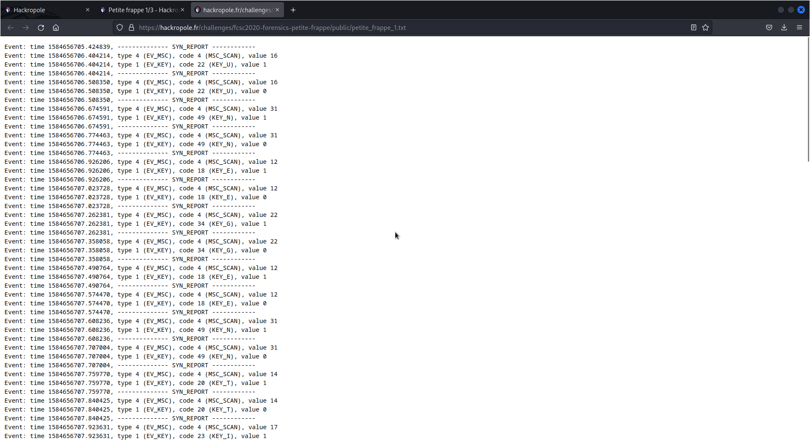

### WUP : Petite frappe

#### Partie 1 

On télécharge le fichier qui contient les résultats du keylogger et on l'ouvre.

Les entrées clavier sont répertoriées dans la section SYN REPORT, entre les parenthèses KEY_U,KEY_N,KEY_E,...  
En lisant l'intégralité des KEY et en enlevant les redondances, on voit que le flag est **UNEGENTILLEPETITEINTRO**. Ce qui est effectivement le cas ...